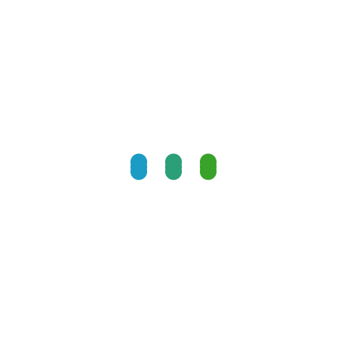
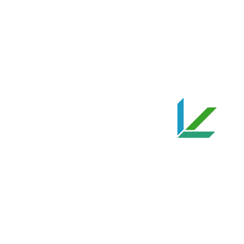

# by 1466587594

## 设计说明

本logo的主要优势为:具有较强的泛用性,在纸质文件打印观感,浏览器标签页显示,app图标,视频片头动画,页面载入效果动画等多方面均可适用,有着尚不差的表现.

文件目录亦提供了logo的部分变种,及动画效果,可供查看.

---

徽标呈箭头状,代表回车键.

蓝绿配色,完全照搬样例,外加了一个两者的混合色,混合色为蓝绿叠加的部分,代表 L 与 C 的重叠区.

主体是稍带圆角又显锐利的字母 L 与 C 的结合,并进行了高度简化.

采用了相对简洁的设计,易于制作各种载入动画,展示动画.

## 内附文件说明

### variant目录

favicon.png:

用于浏览器标签页显示的logo,提高了形状面积占比.

logo2.png:

黑白配色版本,如若涉及文件打印有着还不错的观感.

logo3.png & logo4.png:

logo没有文字,如果在网页页面显示,观感可能会较差,于是另附文字版本logo3.png&logo4.png,使用的字体分别为Arial,Comic Sans MS.

### project_file目录

logo.psd:

photoshop文件,便于修改字体.

谷歌式载入动画.aep & 微软式logo显示.aep & 常见波纹式载入.aep:

AE工程文件,均为文件名字面含义.

### animation目录

animation1.gif:

animation2.gif:

animation3.gif:

